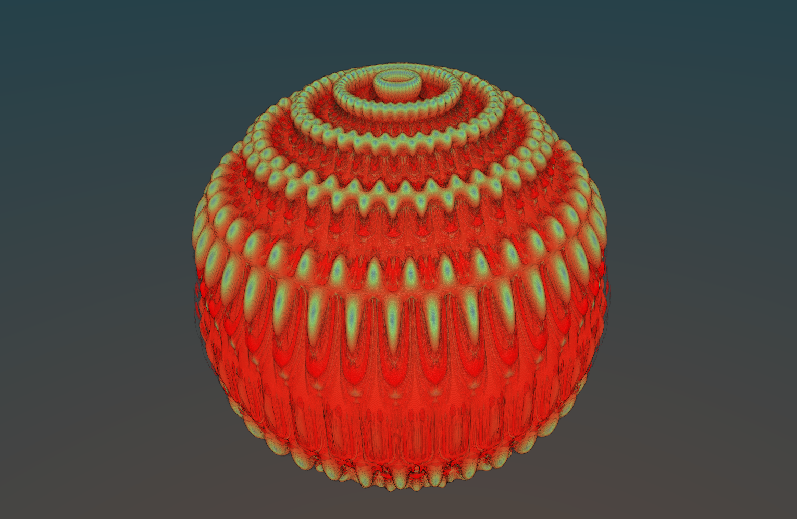
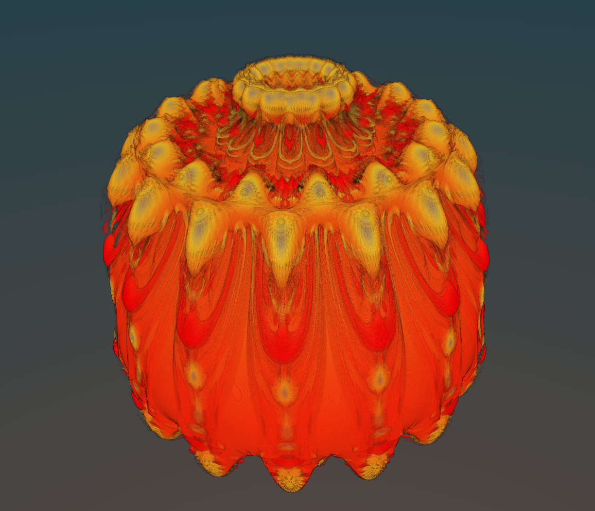
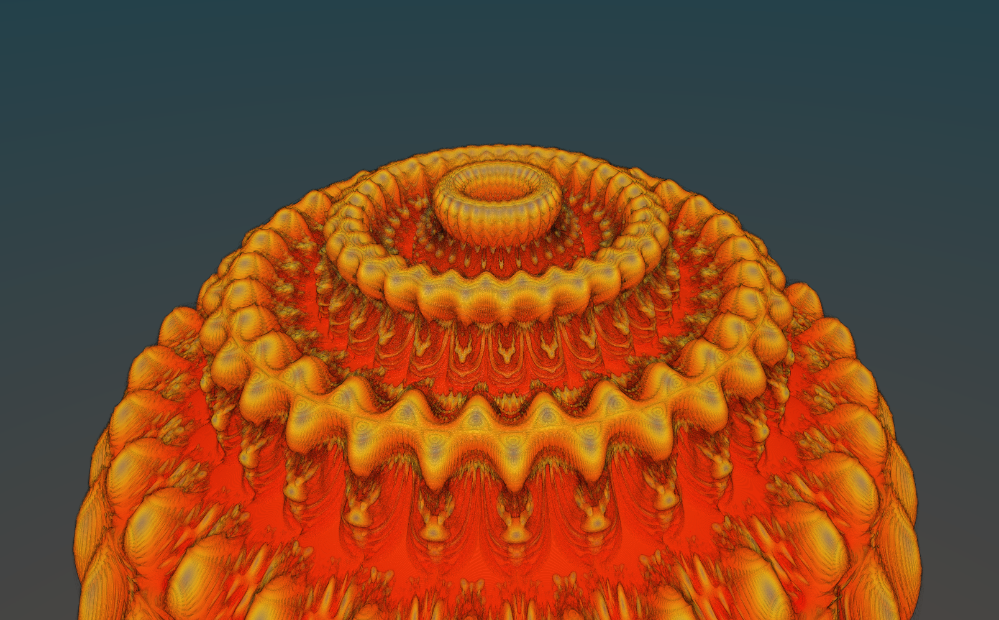
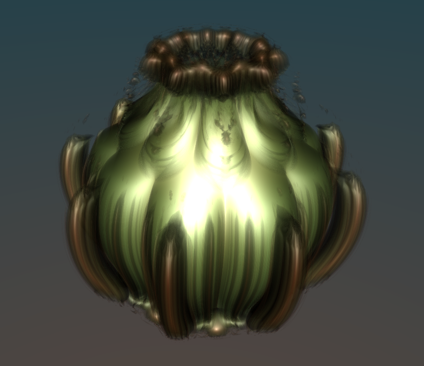
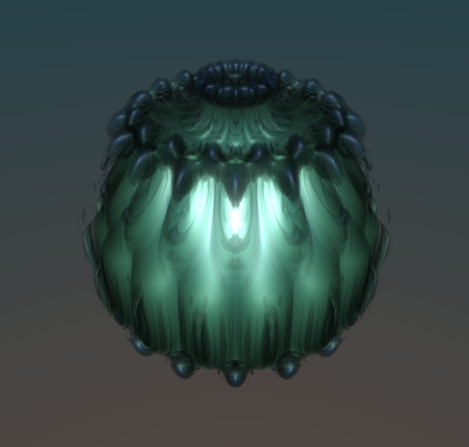
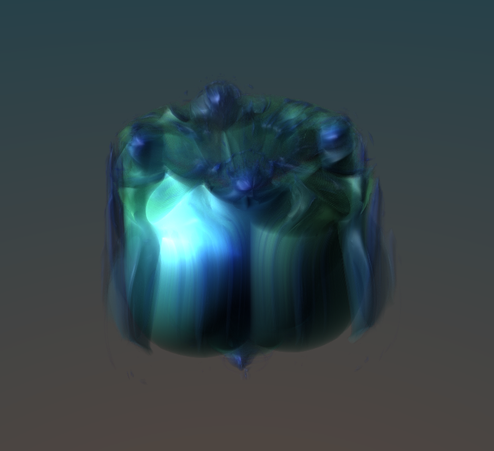

# Mandelbulb synth

A real-time 3D Mandelbulb fractal renderer written in C++ using [Vulkan](https://www.vulkan.org/) and [CUDA](https://developer.nvidia.com/cuda-toolkit).
The application offers an interactive experience, allowing users to adjust various parameters of the visualization in real-time.
A selection of parameters can be animated using Low Frequency Oscillators (LFOs) inspired by analog audio synthesizers.
Adjust the sliders and watch the fractal morph and evolve in fascinating ways.

## Demo video

## Screenshots

